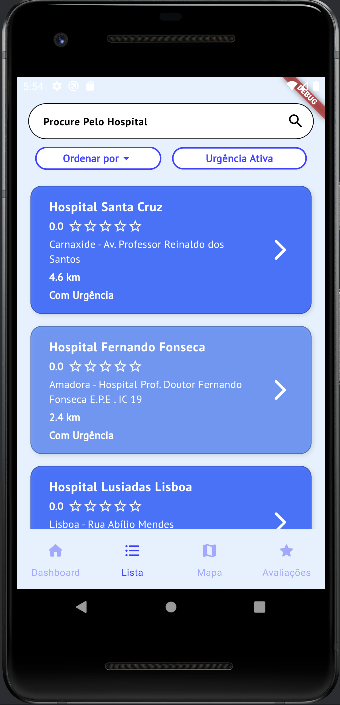
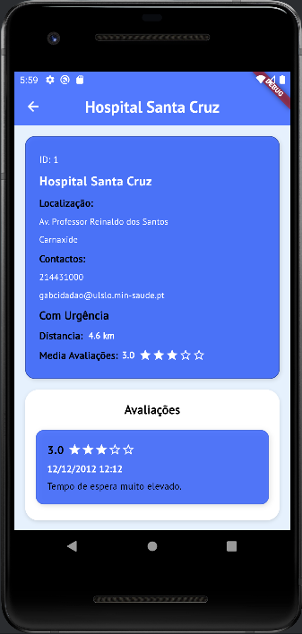
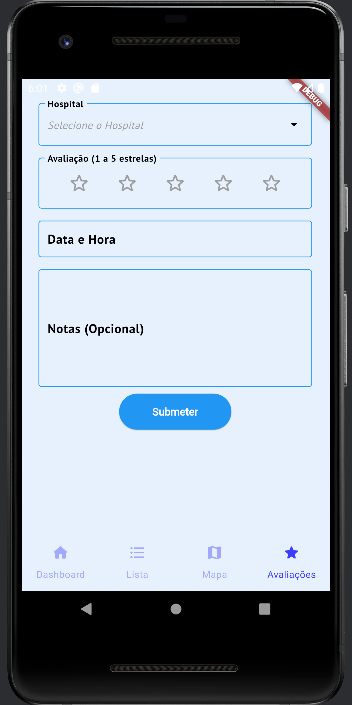

# 📱 Projeto CM – Aplicação de Hospitais (Parte 2)

## 👨‍💻 Alunos

- **André Jesus** – a22207061
- **Tomás Nave** – a22208623

---

## 📝 Descrição Geral

Aplicação móvel desenvolvida em **Flutter/Dart**, com o objetivo de permitir aos utilizadores consultar e avaliar hospitais, promovendo um acesso rápido e eficaz a informações úteis.

A app é composta por **5 páginas principais**, com uma interface intuitiva e funcionalidades otimizadas tanto para uso online como offline.

---

## 🖼️ Capturas de Ecrã

### 📊 Dashboard

### 📋 Lista de Hospitais

### 🏥 Detalhes do Hospital

### 🌟 Avaliação

### 🗺️ Mapa

---

## ✅ Funcionalidades Implementadas

### 📊 DashboardPage
- Barra de pesquisa para procurar hospitais;
- Visualização dos **últimos 2 hospitais acedidos**;
- Apresentação dos **3 hospitais mais próximos** com base nas coordenadas do utilizador.

### 📋 ListaPage
- Listagem completa de hospitais;
- Pesquisa por nome ou localização;
- Filtros disponíveis:
    - Ordenar por **avaliação**;
    - Ordenar por **distância**;
    - Mostrar apenas hospitais com **serviço de urgência**.

### 🏥 DetalhesHospitalPage
- Visualização de informações completas sobre um hospital;
- Listagem das **avaliações existentes** do hospital.

### ✍️ AvaliacaoPage
- Escolha de hospital através de **DropDownSearch** (pesquisa ou lista);
- Avaliação com **estrelas (1 a 5)**;
- Seleção de **data e hora** da avaliação, com validação de inputs – não é possível avaliar um hospital numa data no futuro;
- Campo opcional para **notas**;
- **Validação de campos obrigatórios** (hospital, avaliação e data):
    - Exibição de mensagens de erro se os dados estiverem incompletos ou num formato indesejado;
- **Armazenamento automático da avaliação na base de dados local** após submissão com sucesso.

### 🗺️ MapaPage
- Apresentação de um mapa com **marcadores vermelhos** nos hospitais disponíveis;

### 📡 Funcionalidade Offline
- **Modo offline totalmente funcional** após o primeiro acesso com internet;
- Ao iniciar a aplicação pela primeira vez, os dados dos hospitais são obtidos da API e armazenados numa **base de dados local**;
- Em execuções seguintes, a aplicação verifica automaticamente a **conectividade com a internet**:
    - Se houver ligação, atualiza os dados a partir da API;
    - Se estiver offline, utiliza os dados da base de dados local, garantindo acesso contínuo às informações.

---

## 📚 Fontes de Informação

Durante o desenvolvimento da aplicação, foram consultadas diversas fontes externas para auxiliar na implementação de funcionalidades que não foram abordadas diretamente nas aulas ou nos vídeos fornecidos. Abaixo estão listadas algumas dessas fontes:

- [YouTube – Flutter Google Maps Tutorial](https://youtu.be/M7cOmiSly3Q?si=50yc7vlakMaxRz3Z) – Tutorial utilizado para a **implementação do mapa com marcadores** usando o `google_maps_flutter`;
- 

---

## 🎥 Vídeo de Apresentação

A apresentação da aplicação, demonstrando as principais funcionalidades, pode ser visualizada no seguinte vídeo:

🔗 [HospiFinder](AQUI_COLOCAR_O_LINK)

---

## 🏗️ Arquitetura da Aplicação

<!-- Descrição da arquitetura da aplicação, estrutura de pastas, padrão utilizado, etc. -->

---

## 📚 Documentação das Classes de Lógica de Negócio

Nesta secção serão indicadas e descritas as classes responsáveis pela lógica da aplicação, incluindo o nome das classes, seus métodos principais e os atributos mais relevantes.

<!-- Exemplo:
### NomeDaClasse
- **Atributos:**
  - atributo1: tipo
  - atributo2: tipo
- **Métodos:**
  - metodo1(parâmetros): descrição do que faz
  - metodo2(parâmetros): descrição do que faz
-->

---

## 🧠 Autoavaliação

Consideramos que a aplicação demonstra uma boa maturidade técnica, cobrindo um conjunto robusto de funcionalidades, com particular destaque para a **experiência do utilizador** e a capacidade de operar **offline**. A arquitetura foi pensada para ser eficiente, escalável e resiliente, o que nos permite oferecer um serviço fiável mesmo em contextos que não existe conectividade à internet.

**Nota prevista: 17 valores**

---
