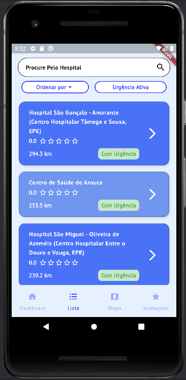
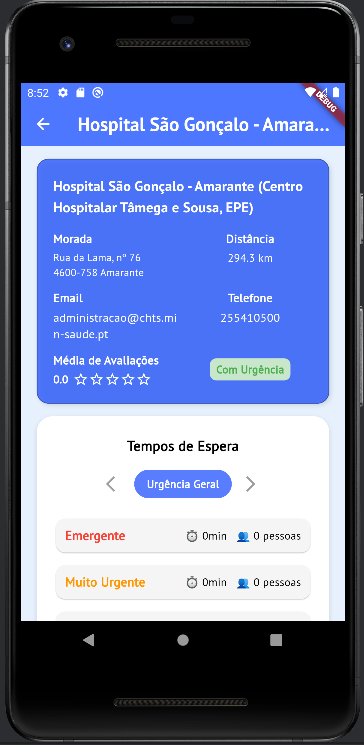
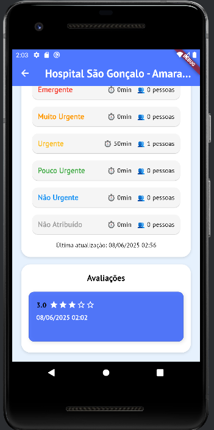
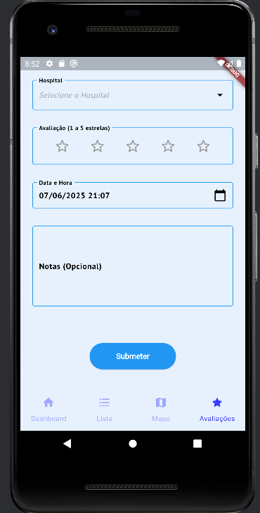
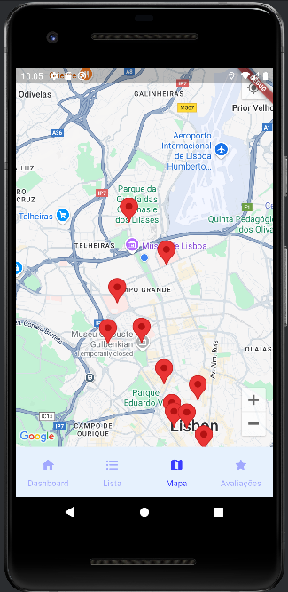

# 📱 Projeto CM – Aplicação de Hospitais (Parte 2)

## 👨‍💻 Alunos

- **André Jesus** – a22207061
- **Tomás Nave** – a22208623

---

## 📝 Descrição Geral

Aplicação móvel desenvolvida em **Flutter/Dart**, com o objetivo de permitir aos utilizadores consultar e avaliar hospitais, promovendo um acesso rápido e eficaz a informações úteis.

A app é composta por **5 páginas principais**, com uma interface intuitiva e funcionalidades otimizadas tanto para uso online como offline.

---

## 🖼️ Capturas de Ecrã

### 📊 Dashboard

### 📋 Lista de Hospitais

### 🏥 Detalhes do Hospital

 
### 🌟 Avaliação

### 🗺️ Mapa

---

## ✅ Funcionalidades Implementadas

### 📊 DashboardPage
- Barra de pesquisa para procurar hospitais;
- Visualização dos **últimos 2 hospitais acedidos**;
- Apresentação dos **3 hospitais mais próximos** com base nas coordenadas do utilizador.

### 📋 ListaPage
- Listagem completa de hospitais;
- Pesquisa por nome ou localização;
- Filtros disponíveis:
    - Ordenar por **avaliação**;
    - Ordenar por **distância**;
    - Mostrar apenas hospitais com **serviço de urgência**.

### 🏥 DetalhesHospitalPage
- Visualização de informações completas sobre um hospital;
- Vizualização dos tempos de espera de diferentes tipos de urgência;
- Listagem das **avaliações existentes** do hospital.

### ✍️ AvaliacaoPage
- Escolha de hospital através de **DropDownSearch** (pesquisa ou lista);
- Avaliação com **estrelas (1 a 5)**;
- Seleção de **data e hora** da avaliação, com validação de inputs – não é possível avaliar um hospital numa data no futuro;
- Campo opcional para **notas**;
- **Validação de campos obrigatórios** (hospital, avaliação e data):
    - Exibição de mensagens de erro se os dados estiverem incompletos ou num formato indesejado;
- **Armazenamento automático da avaliação na base de dados local** após submissão com sucesso.

### 🗺️ MapaPage
- Apresentação de um mapa com **marcadores vermelhos** nos hospitais disponíveis;

### 📡 Funcionalidade Offline
- **Modo offline totalmente funcional** após o primeiro acesso com internet;
- Ao iniciar a aplicação pela primeira vez, os dados dos hospitais são obtidos da API e armazenados numa **base de dados local**;
- Em execuções seguintes, a aplicação verifica automaticamente a **conectividade com a internet**:
    - Se houver ligação, atualiza os dados a partir da API;
    - Se estiver offline, utiliza os dados da base de dados local, garantindo acesso contínuo às informações.

---

## 🎥 Vídeo de Apresentação

A apresentação da aplicação, demonstrando as principais funcionalidades, pode ser visualizada no seguinte vídeo:

🔗 [Video Apresentação HospiFinder](https://youtu.be/pEKdrLqdoxg)

---

## 🏗️ Arquitetura da Aplicação

A arquitetura da nossa aplicação foi pensada e desenvolvida com base nas boas práticas apresentadas nas aulas e nos vídeos recomendados pelo professor. O objetivo foi garantir manutenibilidade, escalabilidade e uma separação clara de responsabilidades, utilizando o padrão Repository para a gestão da camada de dados, injeção de dependências com Provider, e gestão de estado leve com widgets reativos como FutureBuilder e StreamBuilder.

### 📁 Estrutura Modular
A aplicação foi organizada em pastas temáticas, com separação clara entre:

`models/` – Definição das classes de domínio, como Hospital, EvaluationReport e WaitingTime.

`http/` – Contém a classe HttpClient, que centraliza todas as chamadas HTTP e aplica middleware para logging das requisições com pretty_http_logger.

`data/` – Contém os ficheiros relacionados com acesso a dados, como HttpSnsDataSource, SqfliteSnsDataSource e SnsRepository.

`screens/` –  Implementação das várias interfaces (UI) da aplicação, organizadas por ecrã (ex: Dashboard, Lista, Avaliação).

`service/` – Inclui serviços auxiliares como:
    - `location_service.dart`: responsável por obter a localização do utilizador;
    - `connectivity_service.dart`: responsável por verificar o estado da ligação à internet.

`widgets/` – Componentes reutilizáveis da interface, como caixa de hospital.

Esta estrutura facilita a localização e reutilização de código, bem como a integração futura de novas funcionalidades.

### 🧱 Camadas da Aplicação
A arquitetura segue a seguinte divisão em camadas:

1. Camada de Apresentação (UI)
    Responsável por apresentar dados ao utilizador e reagir às suas interações.

    - Implementada com widgets Flutter reativos (FutureBuilder, ListView.builder, etc.), garantindo uma UI fluida e responsiva.

    - A lógica de interface está desacoplada da lógica de dados, o que permite maior facilidade de manutenção e testes.

2. Camada de Lógica de Negócio
    Encapsulada na classe SnsRepository, que atua como intermediário entre a UI e as fontes de dados.

    - Decide dinamicamente, com base na conectividade (connectivity_service), se deve usar a API remota ou a base de dados local.

    - Contém a lógica de filtragem, ordenação e gestão dos últimos hospitais acedidos

3. Camada de Dados
    Composta por duas implementações da interface SnsDataSource:

    - HttpSnsDataSource – Acesso remoto aos dados da API pública do SNS.

    - SqfliteSnsDataSource – Acesso e persistência de dados localmente, usando SQLite.

### 📍 Gestão de Localização
A lógica de localização é gerida através do ficheiro `location_service.dart`, localizado na pasta `service/`.

- A localização é obtida no início de cada página, no momento do carregamento (load), utilizando FutureBuilder.

- Esta abordagem evita chamadas desnecessárias ao GPS, preservando a performance da aplicação.

- Como a app não exige atualização contínua da distância em tempo real, a localização é capturada uma única vez por página e reutilizada durante o seu ciclo de vida.

### 🔌 Offline-First
A aplicação foi concebida com a filosofia offline-first, garantindo que o utilizador tem sempre acesso aos dados dos hospitais, mesmo sem ligação à internet. Para isso:

- Na primeira execução com internet, os dados são armazenados localmente usando Sqflite.

- Em execuções seguintes, a aplicação verifica automaticamente a conectividade:

    - Se estiver online, sincroniza os dados da API com a base de dados local.
    
    - Se estiver offline, utiliza os dados da cache local.

Esta abordagem assegura uma experiência de utilização contínua e fiável, mesmo em ambientes com conectividade instável.

### ✨ Destaques da Arquitetura
A arquitetura da aplicação destaca-se por várias decisões técnicas que melhoram a organização, manutenibilidade, reutilização e performance do código. Estes são alguns dos aspetos mais relevantes:

#### ♻️ Reutilização e Polimorfismo
- Componente HospitalBox reutilizável
  Foi criado um widget personalizado chamado HospitalBox, usado tanto na página de Dashboard como nas Listas. Esta abordagem evita repetição de código e permite centralizar as alterações visuais ou comportamentais do componente hospitalar num único local.

- Utilização de um ficheiro theme.dart personalizado
  A aplicação define um tema global com uma paleta de cores e tamanhos de texto consistentes. Isto facilita alterações globais de estilo, melhora a coerência visual e promove o polimorfismo visual, permitindo que múltiplos componentes usem os mesmos estilos com comportamentos diferentes.

#### 🧩 Organização Modular da Interface
- Separação da lógica da UI em widgets personalizados
  Em vez de manter toda a lógica visual dentro dos ficheiros principais das páginas (screens), foram criados widgets internos e auxiliares. Isto torna o código mais limpo, mais fácil de manter e mais modular, permitindo reestruturações locais sem afetar a totalidade da página.

#### 🧠 Encapsulamento de Lógica nos Modelos
- Métodos específicos dentro das classes Hospital e EvaluationReport
  A lógica relacionada com cada entidade foi colocada nas respetivas classes (ex: métodos como mediaAvaliacoes() ou gerarEstrelasParaHospital()), promovendo o encapsulamento e mantendo a responsabilidade no objeto certo.

#### 🚀 Otimizações de Performance
- Chamadas à API apenas quando necessário
  A aplicação evita chamadas desnecessárias à API. Por exemplo, os tempos de espera não são associados a hospitais nas páginas onde essa informação não é relevante, como o Dashboard. Esta decisão reduz o uso de rede e melhora o tempo de carregamento.

- Geolocalização apenas no início de cada página
  A localização do utilizador é obtida apenas uma vez por página (no carregamento), evitando chamadas repetidas ao GPS. Como a aplicação não tem como objetivo apresentar distâncias atualizadas em tempo real, esta abordagem é mais eficiente e suficiente para o caso de uso.

---

## 📚 Documentação das Classes de Lógica de Negócio

Nesta secção serão indicadas e descritas as classes responsáveis pela lógica da aplicação, incluindo o nome das classes, seus métodos principais e os atributos mais relevantes.

---

### 📘 `EvaluationReport`

Classe responsável por representar uma avaliação feita a um hospital.

- **Atributos:**
  - `id` (`String`) – Identificador único da avaliação.
  - `hospitalId` (`int`) – ID do hospital a que a avaliação pertence.
  - `rating` (`int`) – Avaliação em estrelas (1 a 5).
  - `dataHora` (`DateTime`) – Data e hora da avaliação.
  - `notas` (`String?`) – Campo opcional para comentários adicionais.

- **Métodos:**
  - `toDb()` – Converte o objeto para um mapa (`Map<String, dynamic>`) para ser guardado na base de dados.
  - `fromDb(Map<String, dynamic> map)` – Cria uma instância da classe a partir de dados vindos da base de dados.

---

### 🏥 `Hospital`

Classe que representa um hospital e inclui os dados básicos, bem como uma lista de avaliações associadas.

- **Atributos:**
  - `id` (`int`) – Identificador único do hospital.
  - `name` (`String`) – Nome do hospital.
  - `latitude` (`double`) – Coordenada geográfica (latitude).
  - `longitude` (`double`) – Coordenada geográfica (longitude).
  - `address` (`String`) – Morada do hospital.
  - `phoneNumber` (`int`) – Número de telefone.
  - `email` (`String`) – E-mail de contacto.
  - `district` (`String`) – Distrito onde se localiza.
  - `hasEmergency` (`bool`) – Indica se o hospital tem serviço de urgência.
  - `reports` (`List<EvaluationReport>`) – Lista de avaliações feitas ao hospital.

- **Métodos:**
  - `fromJSON(Map<String, dynamic> json)` – Cria uma instância a partir dos dados vindos da API.
  - `fromDB(Map<String, dynamic> db)` – Cria uma instância a partir dos dados da base de dados local.
  - `toDb()` – Converte o objeto para um mapa para armazenamento na base de dados.
  - `distanciaKm(minhaLat, minhaLon)` – Calcula a distância entre o utilizador e o hospital (em km).
  - `distanciaFormatada(minhaLat, minhaLon)` – Devolve a distância em formato legível (`"300 m"` ou `"2.3 km"`).

---

### ⏱️ `WaitingTime`

Classe responsável por representar e gerir os tempos de espera e o número de pacientes em fila de espera nas urgências hospitalares, agrupados por categorias de triagem (cor).

- **Atributos:**
  - `emergency` (`String`) - Descrição do tipo de urgência (ex: “Emergência Geral”).
  - `waitTimes` (`Map<String, int>`) -  Mapa com os tempos de espera (em segundos) para cada cor de triagem.
  - `queueLengths` (`Map<String, int>`) -  Mapa com o número de pessoas em fila para cada cor de triagem.
  - `lastUpdate` (`DateTime`) - Data e hora da última atualização dos dados.

- **Métodos:**
  - `fromJSON(Map<String, dynamic> json)` - Cria uma instância a partir de dados recebidos por JSON (ex: de uma API).
  - `fromDB(Map<String, dynamic> map)`: Cria uma instância a partir de dados lidos da base de dados local.
  - `toDB(int hospitalId)`: Converte a instância num mapa apropriado para inserção na base de dados.
  - `formatarTempo(int segundos)`: Converte um tempo em segundos para um formato legível, como `"2h15min"` ou `"3d"`.
  - `getlastUpdatedFormatado()`: Devolve a data e hora da última atualização no formato `"dd/mm/yyyy hh:mm"`.

---

### 🛠️ `SnsDataSource` (Interface Abstrata)

Define a interface base para acesso aos dados relacionados com hospitais, avaliações e tempos de espera.

**Métodos abstratos:**

- `Future<void> insertHospital(Hospital hospital)`  
  Insere um hospital na fonte de dados.

- `Future<List<Hospital>> getAllHospitals()`  
  Retorna a lista de todos os hospitais.

- `Future<List<Hospital>> getHospitalsByName(String name)`  
  Pesquisa e retorna hospitais cujo nome contenha a string fornecida.

- `Future<Hospital> getHospitalDetailById(int hospitalId)`  
  Obtém o detalhe completo de um hospital pelo seu ID.

- `Future<void> attachEvaluation(int hospitalId, EvaluationReport report)`  
  Associa uma avaliação a um hospital específico.

- `Future<List<WaitingTime>> getHospitalWaitingTimes(int hospitalId)`  
  Obtém os tempos de espera registados para um hospital.

- `Future<void> insertWaitingTime(int hospitalId, dynamic waitingTime)`  
  Insere um tempo de espera para um hospital.

- `Future<List<EvaluationReport>> getEvaluationsByHospitalId(Hospital hospital)`  
  Obtém as avaliações associadas a um hospital.

-`Future<void> adicionarUltimoAcedido(int hospitalId)`
  Adiciona o hospital ultimo acedido.

---

### ⚙️ `HttpSnsDataSource`

Implementa a interface `SnsDataSource` com acesso a dados remotos via API HTTP.

- Utiliza a API pública do Ministério da Saúde para obter a lista de hospitais.
- Métodos que modificam dados (`insertHospital`, `attachEvaluation`, etc.) não estão disponíveis e lançam exceção.
- Métodos implementados:
  - `getAllHospitals()`
  - `getHospitalDetailById(int hospitalId)`
  - `getHospitalsByName(String name)`

Métodos relacionados com avaliação, tempos de espera e ultimos acedidos ainda não implementados (`UnimplementedError`).

---

### 🧱 `SqfliteSnsDataSource`

Implementa a interface `SnsDataSource` usando uma base de dados local SQLite.

- Cria e gerencia as tabelas `hospital` e `avaliacao`.
- Permite inserção e recuperação de hospitais e avaliações localmente.
- Métodos implementados:
  - `init()` — inicializa a base de dados.
  - `insertHospital(Hospital hospital)`
  - `getAllHospitals()`
  - `getHospitalDetailById(int hospitalId)`
  - `getHospitalsByName(String name)`
  - `attachEvaluation(int hospitalId, EvaluationReport report)`
  - `getEvaluationsByHospitalId(Hospital hospital)`
  - `adicionarUltimoAcedido(int hospitalId)`
- Métodos para tempos de espera ainda não implementados.

---

### 📦 `SnsRepository`

Classe repositório que combina as fontes de dados local (`SqfliteSnsDataSource`) e remota (`HttpSnsDataSource`) e decide qual usar conforme a conectividade.

- Verifica se o dispositivo está online para decidir entre usar dados remotos ou locais.
- Atualiza a base de dados local com dados remotos para cache e acesso offline.
- Implementa funcionalidades adicionais:
  - Gestão da lista dos últimos hospitais acedidos.
  - Filtragem e ordenação de hospitais (por distância, por avaliação, presença de urgência).
  - Geração de widgets para visualização de avaliação com estrelas.
  - Obtenção da localização atual do utilizador.
- Métodos implementados:
  - Todos os definidos na interface `SnsDataSource`.
- Métodos para tempos de espera ainda não implementados.

---

## 📚 Fontes de Informação

Durante o desenvolvimento da aplicação, foram consultadas diversas fontes externas para auxiliar na implementação de funcionalidades que não foram abordadas diretamente nas aulas ou nos vídeos fornecidos. Abaixo estão listadas algumas dessas fontes:

- [YouTube – Flutter Google Maps Tutorial](https://youtu.be/M7cOmiSly3Q?si=50yc7vlakMaxRz3Z) – Tutorial utilizado para a **implementação do mapa com marcadores** usando o `google_maps_flutter`;
- [Introdução ao Dart e ao Flutter](https://www.youtube.com/watch?v=b4ZxFLW7neQ&list=PL_wKlpKIC9vWubXsj3IRPZ2Rk6QMfsPPg)  - Tutorial para ajuda no desenvolvimento de algumas funcionalidades do projeto.
- [TAB BAR • Flutter Widget of the Day #13](https://www.youtube.com/watch?v=XSheN4Lkhpc)  - Tutorial para ajuda na implementação de uma Tab Bar para os WaitingTimes 

---

## 🧠 Autoavaliação

Consideramos que a aplicação demonstra uma boa maturidade técnica, cobrindo um conjunto robusto de funcionalidades, com particular destaque para a **experiência do utilizador** e a capacidade de operar **offline**. A arquitetura foi pensada para ser eficiente, escalável e resiliente, o que nos permite oferecer um serviço fiável mesmo em contextos que não existe conectividade à internet.

**Nota prevista: 17 valores**

---
